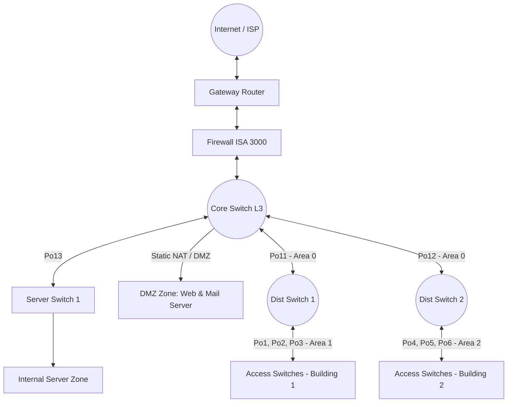

# Đồ án Thiết lập và Cấu hình Mạng LAN trên Cisco Packet Tracer

**> **🌐 **Language / Ngôn ngữ:** **[English](README.md)** | **[Tiếng Việt](README-vn.md)** 

Repository này chứa toàn bộ mã nguồn cấu hình thiết bị, file mô phỏng sơ đồ mạng (`.pkt`) và tài liệu hướng dẫn triển khai hệ thống mạng LAN doanh nghiệp quy mô vừa. Dự án được thực hiện trong khuôn khổ môn học **An ninh máy tính**, năm học 2026 - 2027.

## 📊 Tổng quan dự án

Dự án tập trung thiết kế và triển khai một hạ tầng mạng LAN toàn diện, tích hợp các cơ chế dự phòng băng thông, định tuyến động phân vùng và cấu hình biên mạng bảo mật phục vụ các dịch vụ cốt lõi.

### Các công nghệ lõi triển khai

* **Hạ tầng đường truyền:** L2/L3 EtherChannel (LACP & PAgP), VLAN, Trunking (802.1Q), VTP.
* **Định tuyến nội bộ:** Định tuyến động OSPF đa vùng (Multi-area OSPF), SVI Layer 3, Route Redistribution.
* **Biên mạng & Bảo mật:** Định tuyến tĩnh Firewall (ISA 3000), ACLs, Static NAT (DMZ Servers) và PAT (NAT Overload cho người dùng nội bộ).
* **Dịch vụ mạng:** DHCP Relay Agent, DNS Server (A Record), HTTP/FTP.

---

## 🗺️ Sơ đồ kiến trúc & Phân chia phân vùng (Topology)

Hệ thống được tổ chức thành 4 phân vùng chính kết nối tập trung về Core Switch:



### 📅 Bảng quy hoạch mạng (IP Subnetting)

| Kết nối / Vùng mạng        | Địa chỉ Subnet    | Ghi chú kỹ thuật                        |
| :----------------------------- | :------------------- | :----------------------------------------- |
| **CoreSW - Firewall**    | `10.10.10.0/24`    | Transit Network                            |
| **CoreSW - Dist-SW1**    | `10.10.20.0/24`    | L3 EtherChannel (Port-channel 11)          |
| **CoreSW - Dist-SW2**    | `10.10.30.0/24`    | L3 EtherChannel (Port-channel 12)          |
| **CoreSW - Server-SW1**  | `10.10.40.0/24`    | L3 EtherChannel (Port-channel 13)          |
| **Internal Server**      | `10.50.50.0/24`    | Phân vùng máy chủ nội bộ (DHCP, DNS) |
| **Building 1**           | `172.16.0.0/16`    | VLAN 10 đến VLAN 16 (Học qua VTP)       |
| **Building 2**           | `172.20.0.0/16`    | VLAN 20 đến VLAN 26 (Học qua VTP)       |
| **DMZ Zone**             | `192.168.100.0/24` | Vùng phân giải Public Server            |
| **Firewall - Gateway**   | `192.168.200.0/24` | Biên mạng kết nối Router               |
| **Gateway Router - ISP** | `203.1.1.4/30`     | Mạng WAN kết nối nhà mạng             |
| **ISP Public Zone**      | `204.1.1.0/24`     | Giả lập vùng Internet công cộng       |

---

## 🛠️ Hướng dẫn cấu hình chi tiết (Mẫu câu lệnh CLI)

### 1. Cấu hình L3 EtherChannel (CoreSW <-> Dist-SW1)

Biến khoảng cổng vật lý thành cổng định tuyến logic gộp băng thông qua LACP:

```cisco
! Trên CoreSW
interface range GigabitEthernet1/0/1-2
 no switchport
 channel-group 11 mode active
 no shutdown
!
interface port-channel 11
 no switchport
 ip address 10.10.20.1 255.255.255.0
 no shutdown
```

### 2. Cấu hình Hạ tầng L2 Trunking & VTP (Dist-SW1 <-> Access Switches)

Đồng bộ tự động cơ sở dữ liệu mạng ảo xuống các tầng Access qua PAgP và Trunking:

```cisco
! Cấu hình VTP Server trên Distribution Switch
vtp domain hcmus1
vtp mode server
vtp password 123

! Gộp đường Trunk L2 bằng giao thức PAgP
interface range GigabitEthernet1/0/1-2
 channel-group 1 mode desirable
 no shutdown
!
interface port-channel 1
 switchport mode trunk
 switchport trunk allowed vlan 10-16
```

### 3. Cấu hình Định tuyến động OSPF đa vùng & Route Redistribution

Bật tính năng định tuyến trên Switch L3, phân chia vùng xử lý giảm tải và trỏ tiếp hop mạng:

```cisco
! Trên CoreSW
ip routing
router ospf 1
 router-id 1.1.1.1
 network 10.10.20.0 0.0.0.255 area 0
 network 10.10.30.0 0.0.0.255 area 0
 redistribute static subnets
! Định tuyến tĩnh trỏ về phân vùng Internal Server và Firewall
ip route 10.50.50.0 255.255.255.0 10.10.40.2
```

### 4. Thiết lập DHCP Relay Agent

Chuyển tiếp yêu cầu xin cấp phát IP từ các VLAN người dùng sang DHCP Server tập trung (`10.50.50.254`):

```cisco
interface vlan 10
 ip address 172.16.10.1 255.255.255.0
 ip helper-address 10.50.50.254
 no shutdown
```

### 5. Cấu hình Biên mạng Bảo mật (NAT/PAT trên Gateway Router)

Ánh xạ các server DMZ ra ngoài và gom toàn bộ lưu lượng IP Private nội bộ ra Internet an toàn:

```cisco
! Static NAT cho DMZ Servers
ip nat inside source static 192.168.100.111 5.5.5.33
ip nat inside source static 192.168.100.222 5.5.5.34

! Định nghĩa Access List và liên kết PAT Pool (Overload)
ip access-list standard 1
 permit 172.16.0.0 0.0.255.255
 permit 172.20.0.0 0.0.255.255
 permit 10.50.50.0 0.0.0.255
!
ip nat pool PAT-POOL 5.5.5.35 5.5.5.35 netmask 255.255.255.248
ip nat inside source list 1 pool PAT-POOL overload
```

---

## 🔍 Hướng dẫn Kiểm tra & Xác minh hệ thống (Verification)

Để kiểm tra trạng thái hoạt động của các dịch vụ, truy cập giao diện CLI dòng lệnh của các thiết bị tương ứng và sử dụng chuỗi tập lệnh sau:

* **Xác minh cổng gộp logic (EtherChannel):**

  ```bash
  CoreSW# show etherchannel summary
  ```

  *Yêu cầu:* Các nhóm hiển thị trạng thái `(RU)` đối với L3 hoặc `(SU)` đối với L2, các cổng thành phần ghi nhận trạng thái cổng vật lý hoạt động `(P)`.
* **Xác minh các tuyến mạng học được (Routing Table):**

  ```bash
  CoreSW# show ip route
  Dist-SW1# show ip route
  Firewall# show route
  ```

  *Yêu cầu:* Xuất hiện đầy đủ chỉ ký tự `O IA` (OSPF inter area) biểu thị các phân vùng tòa nhà đã thông suốt dữ liệu lẫn nhau và có Default Route `S*` đẩy lưu lượng ra biên mạng.
* **Xác minh phiên dịch địa chỉ NAT biên:**

  ```bash
  Gateway-Router# show ip nat translations
  ```

  *Yêu cầu:* Bảng hiển thị thông tin khớp chính xác dữ liệu chuyển đổi cổng giữa các cặp `inside local` ra `inside global`.

---

## 📌 Kết luận & Hạn chế của Lab

* **Đạt được:** Mô phỏng thành công kiến trúc mạng cấu trúc phân tầng doanh nghiệp chuẩn. Cân bằng tải tốt, dự phòng thảm họa đường truyền vật lý hiệu quả (nhờ EtherChannel kết hợp định tuyến OSPF). Hệ thống cấp phát IP tĩnh/động tự động chuẩn xác.
* **Hạn chế hiện tại:** Hệ thống chưa đặt cấu hình định danh tên thiết bị (`hostname`) chi tiết trên CLI dễ gây nhầm lẫn khi cấu hình hàng loạt; tệp topo thiết kế nặng nên thời gian hội tụ mạng (network convergence) ban đầu khi khởi động tệp tương đối lâu (**mất từ 3 - 5 phút**).

---

## 🗂️ Cấu trúc thư mục Repository

```text
├── backups/            # Contains backup files or older configuration versions
├── docs/               # Contains project report documents (PDF/Word)
├── src/                # Main source code directory of the project
│   └── config/         # Stores detailed configuration files for each network device
│       ├── firewall/   # Configurations for the ISA 3000 Firewall
│       ├── l2-sws/     # Configurations for Layer 2 Access Switches (Acc-SW1 to Acc-SW6)
│       ├── l3-sws/     # Configurations for CoreSW and Layer 3 Distribution Switches
│       ├── other/      # Configurations for auxiliary devices (e.g., Multilayer Switch 0)
│       ├── routers/    # Configurations for the Gateway Router and ISP Router
│       └── servers/    # Text/YAML files saving IP allocation and service details for Servers
├── topology/           # Contains the Packet Tracer network simulation file (.pkt)
├── .gitignore          # Configuration file to ignore unnecessary files when pushing to Git
├── README-vn.md        # Project documentation and guide in Vietnamese
└── README.md           # Project documentation and guide in English (Default)
```
