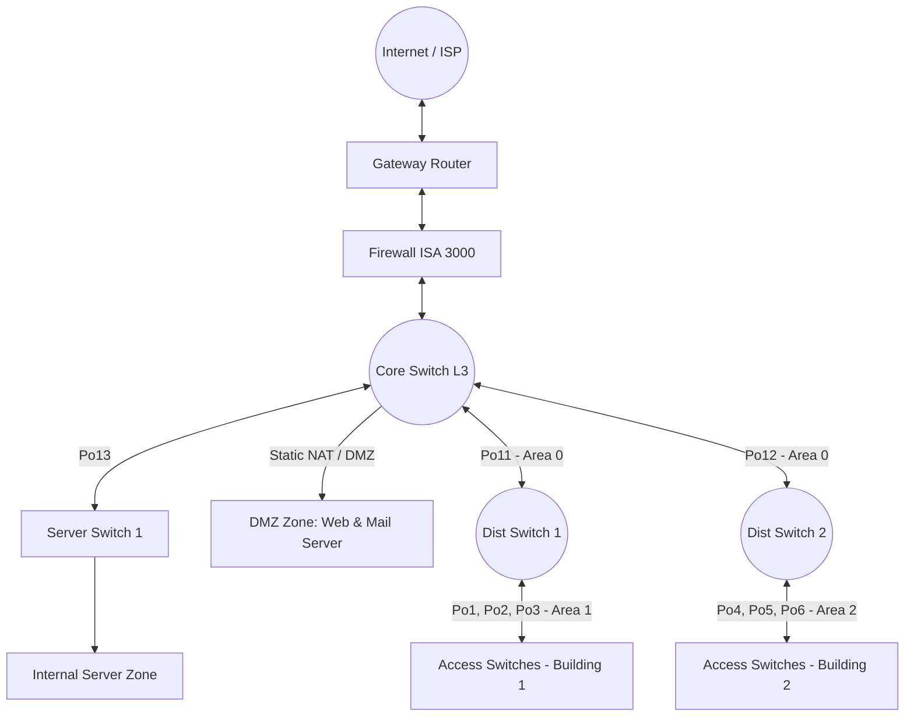

# LAN Network Design and Configuration Project on Cisco Packet Tracer

**> **🌐 **Language / Ngôn ngữ:** **[English](README.md)** | **[Tiếng Việt](README-vn.md)**

This repository contains all device configuration source codes, the network topology simulation file (`.pkt`), and implementation guides for a medium-sized enterprise LAN network system. This project was conducted within the scope of the **Computer Security** course for the academic year 2026 - 2027.

## 📊 Project Overview

The project focuses on designing and deploying a comprehensive LAN infrastructure, integrating bandwidth redundancy mechanisms, multi-area dynamic routing, and secure edge network configurations to support core services.

### Core Implemented Technologies

* **Link Infrastructure:** L2/L3 EtherChannel (LACP & PAgP), VLAN, Trunking (802.1Q), VTP.
* **Internal Routing:** Multi-area Open Shortest Path First (Multi-area OSPF), Layer 3 SVI, Route Redistribution.
* **Edge Network & Security:** Static Routing on Firewall (ISA 3000), ACLs, Static NAT (for DMZ Servers), and PAT (NAT Overload for internal users).
* **Network Services:** DHCP Relay Agent, DNS Server (A Record), HTTP/FTP.

---

## 🗺️ Network Architecture & Zone Segmentation (Topology)

The system is organized into 4 main zones that connect centrally to the Core Switch:



### 📅 IP Subnet Allocation (IP Subnetting)

| Connection / Network Zone      | Subnet Address       | Technical Notes                            |
| :----------------------------- | :------------------- | :----------------------------------------- |
| **CoreSW - Firewall**    | `10.10.10.0/24`    | Transit Network                            |
| **CoreSW - Dist-SW1**    | `10.10.20.0/24`    | L3 EtherChannel (Port-channel 11)          |
| **CoreSW - Dist-SW2**    | `10.10.30.0/24`    | L3 EtherChannel (Port-channel 12)          |
| **CoreSW - Server-SW1**  | `10.10.40.0/24`    | L3 EtherChannel (Port-channel 13)          |
| **Internal Server**      | `10.50.50.0/24`    | Internal Server Zone (DHCP, DNS)           |
| **Building 1**           | `172.16.0.0/16`    | VLAN 10 to VLAN 16 (Synchronized via VTP)  |
| **Building 2**           | `172.20.0.0/16`    | VLAN 20 to VLAN 26 (Synchronized via VTP)  |
| **DMZ Zone**             | `192.168.100.0/24` | Public Server Resolution Zone              |
| **Firewall - Gateway**   | `192.168.200.0/24` | Perimeter Network connecting Router        |
| **Gateway Router - ISP** | `203.1.1.4/30`     | WAN Network connecting to Service Provider |
| **ISP Public Zone**      | `204.1.1.0/24`     | Simulated Public Internet Zone             |

---

## 🛠️ Detailed Configuration Guide (CLI Command Samples)

### 1. L3 EtherChannel Configuration (CoreSW <-> Dist-SW1)

Bundling physical interfaces into a logical routed port to aggregate bandwidth via LACP:

```cisco
! On CoreSW
interface range GigabitEthernet1/0/1-2
 no switchport
 channel-group 11 mode active
 no shutdown
!
interface port-channel 11
 no switchport
 ip address 10.10.20.1 255.255.255.0
 no shutdown
```

### 2. L2 Trunking & VTP Infrastructure Configuration (Dist-SW1 <-> Access Switches)

Automatically synchronizing the virtual network database down to the Access layer switches via PAgP and Trunking:

```cisco
! Configure VTP Server on the Distribution Switch
vtp domain hcmus1
vtp mode server
vtp password 123

! Aggregate L2 Trunk links using the PAgP protocol
interface range GigabitEthernet1/0/1-2
 channel-group 1 mode desirable
 no shutdown
!
interface port-channel 1
 switchport mode trunk
 switchport trunk allowed vlan 10-16
```

### 3. Multi-area OSPF Dynamic Routing & Route Redistribution Configuration

Enabling routing capabilities on the L3 Multilayer Switch, segmenting processing areas to reduce load, and defining next-hops:

```cisco
! On CoreSW
ip routing
router ospf 1
 router-id 1.1.1.1
 network 10.10.20.0 0.0.0.255 area 0
 network 10.10.30.0 0.0.0.255 area 0
 redistribute static subnets
! Static routing pointing towards the Internal Server zone and Firewall
ip route 10.50.50.0 255.255.255.0 10.10.40.2
```

### 4. DHCP Relay Agent Implementation

Forwarding IP address allocation requests from user VLANs to the centralized DHCP Server (`10.50.50.254`):

```cisco
interface vlan 10
 ip address 172.16.10.1 255.255.255.0
 ip helper-address 10.50.50.254
 no shutdown
```

### 5. Secure Edge Network Configuration (NAT/PAT on Gateway Router)

Mapping DMZ servers out to public IPs and translating all internal private IP traffic to access the Internet securely:

```cisco
! Static NAT for DMZ Servers
ip nat inside source static 192.168.100.111 5.5.5.33
ip nat inside source static 192.168.100.222 5.5.5.34

! Define Access List and bind it to the PAT Pool (Overload)
ip access-list standard 1
 permit 172.16.0.0 0.0.255.255
 permit 172.20.0.0 0.0.255.255
 permit 10.50.50.0 0.0.0.255
!
ip nat pool PAT-POOL 5.5.5.35 5.5.5.35 netmask 255.255.255.248
ip nat inside source list 1 pool PAT-POOL overload
```

---

## 🔍 Verification & Testing Guide (Verification)

To check the operational status of network services, access the command-line interface (CLI) of the respective devices and execute the following verification commands:

* **Verify aggregated logical links (EtherChannel):**

  ```bash
  CoreSW# show etherchannel summary
  ```

  *Expected Output:* Groups must display a status of `(RU)` for L3 or `(SU)` for L2, and component ports must log an active physical port status of `(P)`.
* **Verify learned network routes (Routing Table):**

  ```bash
  CoreSW# show ip route
  Dist-SW1# show ip route
  Firewall# show route
  ```

  *Expected Output:* The routing table must properly display the `O IA` symbol (OSPF inter area) indicating that the building partitions are fully communicating with each other, along with a Default Route `S*` forwarding edge traffic.
* **Verify edge address translations (NAT):**

  ```bash
  Gateway-Router# show ip nat translations
  ```

  *Expected Output:* The table must display accurate port translation pairings mapping `inside local` addresses to `inside global` addresses.

---

## 📌 Conclusion & Lab Limitations

* **Achievements:** Successfully simulated a standard hierarchical enterprise network architecture. Handled load balancing well and ensured efficient physical layer link redundancy (utilizing EtherChannel combined with OSPF routing). Automatic static/dynamic IP allocation functions as expected.
* **Current Limitations:** Network devices lack explicit device identifier configuration (`hostname`) on the CLI, which can lead to confusion during bulk configurations. The topology layout file is heavy; therefore, the initial network convergence time when loading the file is relatively long (**takes approximately 3 to 5 minutes**).

---

## 🗂️ Repository Directory Structure

```text
├── backups/            # Contains backup files or older configuration versions
├── docs/               # Contains project report documents (PDF/Word)
├── src/                # Main source code directory of the project
│   └── config/         # Stores detailed configuration files for each network device
│       ├── firewall/   # Configurations for the ISA 3000 Firewall
│       ├── l2-sws/     # Configurations for Layer 2 Access Switches (Acc-SW1 to Acc-SW6)
│       ├── l3-sws/     # Configurations for CoreSW and Layer 3 Distribution Switches
│       ├── other/      # Configurations for auxiliary devices (e.g., Multilayer Switch 0)
│       ├── routers/    # Configurations for the Gateway Router and ISP Router
│       └── servers/    # Text/YAML files saving IP allocation and service details for Servers
├── topology/           # Contains the Packet Tracer network simulation file (.pkt)
├── .gitignore          # Configuration file to ignore unnecessary files when pushing to Git
├── README-vn.md        # Project documentation and guide in Vietnamese
└── README.md           # Project documentation and guide in English (Default)
```
